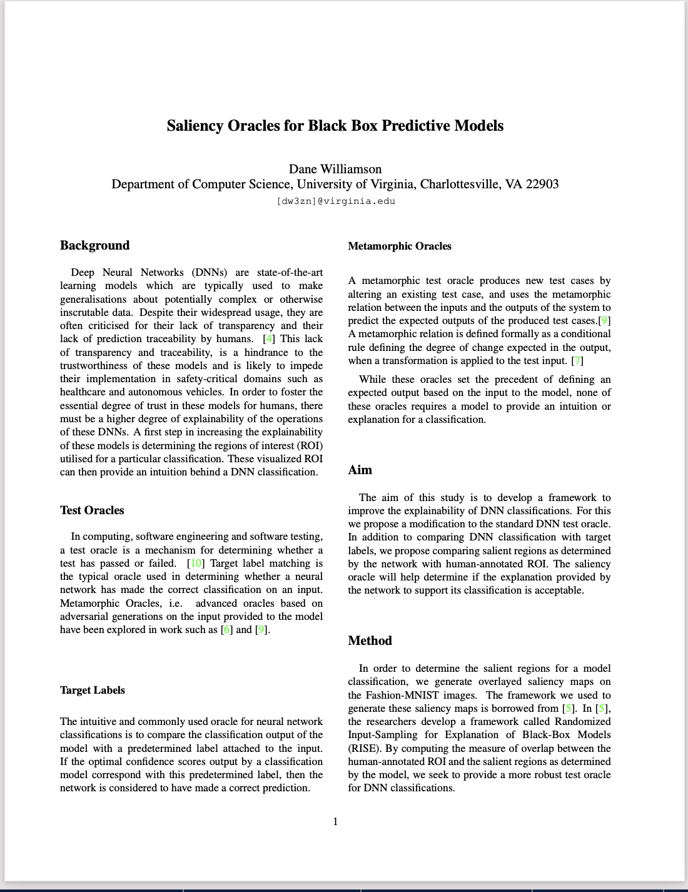
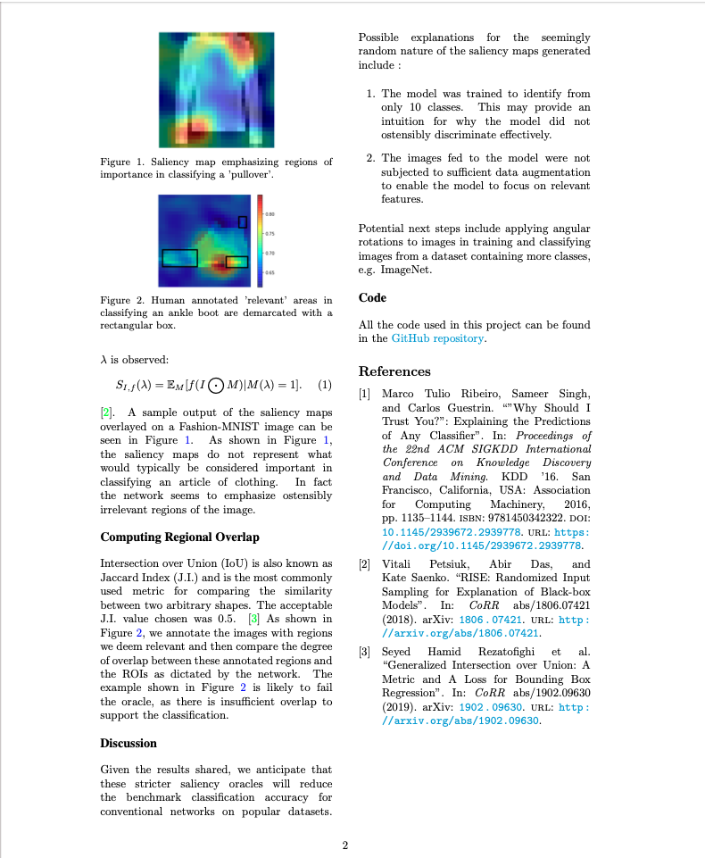
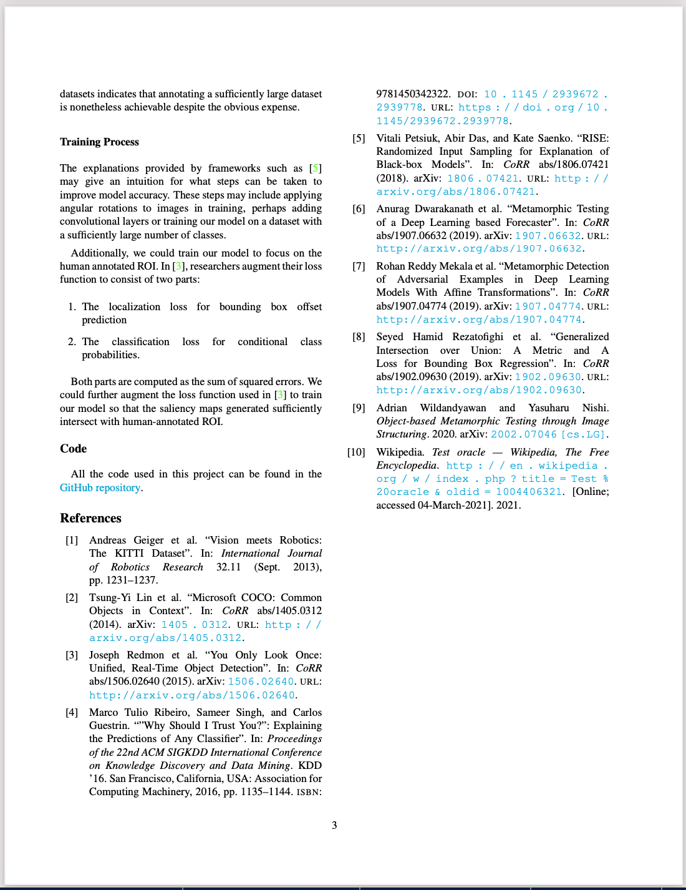

Generate saliency maps for model classifications of [fashion-mnist](https://github.com/zalandoresearch/fashion-mnist) images.

Uses the RISE technique outlined [here](https://github.com/eclique/RISE).

Report attached below:

